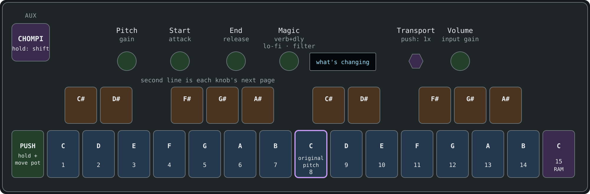
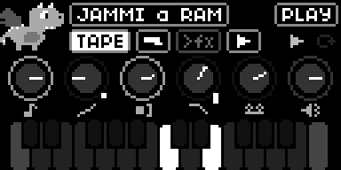
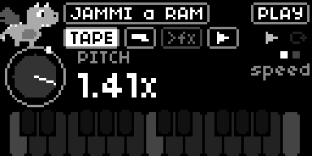
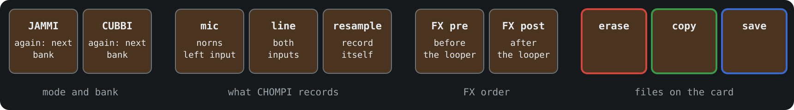
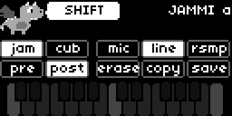
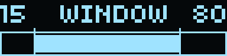
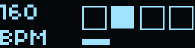

# nidhogg

nidhogg is the CHOMPI [open source firmware](https://github.com/CHOMPI-Club/CHOMPI) adapted to [norns](https://monome.org/docs/norns/) and designed around the [OMX-27](https://github.com/okyeron/OMX-27).

Each of the three firmwares (TAPE, TEMPO, WAVE) is run using the actual code from the CHOMPI source, adapted to run under Linux. You can switch between them in the norns parameter edit screen - the state of each is saved when you switch away and resumed when you come back.

This has only been tested on my [shieldXL](https://github.com/okyeron/shieldXL) unit with a Pi4 2GB inside but it should run fine on a Pi3 unit - like an official norns. Only the OMX-27 and the Exquis are supported so far, if you'd like another controller supported please come chat with me in #nidhogg **[on my discord](https://discord.gg/9Wun47jGC6)** or open an issue here.

Thanks to the team at CHOMPI for open sourcing it, I hope this port does it justice.

Enjoy! 
Dan

---

- [What you need](#what-you-need)
- [Installing](#installing)
- [The keys and knobs](#the-keys-and-knobs)
- [The norns screen](#the-norns-screen)
- [Knobs and pages](#knobs-and-pages)
- [Playing samples](#playing-samples)
- [Shift](#shift)
- [Recording a sample](#recording-a-sample)
- [The looper](#the-looper)
- [The OMX screen](#the-omx-screen)
- [Other controllers](#other-controllers)
- [Importing samples](#importing-samples)
- [The library](#the-library)
- [Settings](#settings)
- [TEMPO](#tempo)
- [WAVE](#wave)
- [Credits](#credits)

## What you need

- A [norns](https://monome.org/docs/norns/) or [norns shield](https://github.com/okyeron/shieldXL).
- An OMX-27 plugged into the norns by USB, any of the three boards, or one of the [other controllers](#other-controllers).
- About 200 MB free, and wifi the first time.

The OMX-27 needs Quixotic7's firmware, 1.15.4 or newer. If it has something older nidhogg offers to update it: press **K3** to update or **K2** to skip. Updating clears the OMX-27's saved patterns. On a Teensy unit you may need to press the button on the Teensy when the screen asks.

## Installing

1. In maiden, type `;install https://github.com/roge-rm/nidhogg` into the REPL.
2. Load nidhogg from **SELECT**.
3. The first time, it downloads CHOMPI's factory samples, installs its SuperCollider plugins and restarts SuperCollider. This takes a few minutes, then nidhogg loads by itself.

The samples are in `dust/audio/nidhogg`, one folder per firmware, laid out like a CHOMPI SD card. To add your own, see [Importing samples](#importing-samples).

If SuperCollider won't start after you've been logged in over ssh, restart the norns.

## The keys and knobs

**AUX** is the CHOMPI key. The bottom row from the second key up and the ten top keys are CHOMPI's keyboard. The top keys play the sharps, and with **AUX** held they're the shift menu.

On the norns, **E1** is CHOMPI's switch. Left is Play, where **AUX** is shift. Right is Record, where **AUX** records. **K2** is PLAY, **K3** is LOOP, **E2** is Transport and **E3** is Volume.

The keys light up the same way CHOMPI's do.

## The norns screen

- The little dragon chomps when you play a note, puts headphones on when you record, bobs along when something's playing and gets sleepy before the screensaver.
- The top row is what's loaded and where the switch is. Under it are the firmware, the input, the effects order and the looper.
- The six knobs are Pitch, Start, End, Magic, Transport and Volume. Their rings light up like CHOMPI's knob lights, and a mark on the side means a knob is on page 2 or 3.
- The keyboard lights up like the OMX keys.

## Knobs and pages

Each knob does two or three things, called pages. Hold **PUSH** (the leftmost bottom key, or **K1**) and nudge a pot to go to its next page.

A pot won't do anything until you sweep it past where the knob is set, then it takes over. The norns shows the knob up close while you turn it, with a dot where the pot is.

Pitch is a little sticky in the middle, so it's easy to get back to.

| Knob | Page 1 | Page 2 | Page 3 |
|---|---|---|---|
| **Pitch** | speed. Right of the middle plays forward, left plays backwards | gain | |
| **Start** | where it starts playing | attack | |
| **End** | where it stops | release | |
| **Magic** | reverb and delay | lo-fi | filter |
| **Volume** | volume | input gain | |
| **Transport** | looper speed. Push for normal speed | | |

## Playing samples

In JAMMI you play one sample across the keyboard. In CUBBI every white key has its own sample.

To pick a sample, hold **AUX** and press a white key. Keys 1-14 are the samples in the bank and key 15 is your own recording.

## Shift

Hold **AUX** and the top keys and pots do something else.

- **Pitch** tunes in fifths and fourths, and on page 2 it's pan.
- **Start** and **End** move the whole sample window.
- **Magic** sets the delay time.
- **Volume** sets the compressor.
- **K2** and **K3** set the overdub level.

The lit chips on the norns are what's chosen now.

## Recording a sample

1. Turn **E1** right.
2. Hold **AUX** while you make the sound.
3. Turn **E1** left and play it on the keys.

To keep it, hold **AUX**, press **save**, press a white key 1-14, then press **AUX** again.

## The looper

- **LOOP** starts recording. Press it again to close the loop and keep overdubbing, and again to stop.
- **PLAY** stops and starts the tape. Hold it to rewind.
- Hold **PLAY** and **LOOP** to clear it.
- **Transport** changes the tape speed, and scrubs when it's stopped.

## The OMX screen

The little screen shows your knobs as five bars, one per pot, with a box when a knob is on page 2 or 3. A line in a bar is a pot that hasn't taken over yet. It switches to the sample window when you turn **Start** or **End**, and to the levels when you record. Tap **PUSH** to pick what it shows the rest of the time.

| | |
|---|---|
|  Knobs |  Levels, in and out |
|  The sample window, between Start and End |  The beat and tempo, in TEMPO and WAVE |

## Other controllers

nidhogg can also be played from these, plugged into the norns by USB. Each has its own page:

- [Exquis](docs/exquis.md) by Intuitive Instruments

## Importing samples

nidhogg keeps a sample library on the norns, in `dust/audio/nidhogg/library`. CHOMPI's banks are what's loaded from it right now, and you can swap any pack in or out.

Plug a USB stick into the norns and the import screen comes up. You can also put files in `dust/audio/nidhogg/import` through maiden and open it from **PARAMETERS > EDIT > import samples**.

1. **E2** moves through the packs. Each folder of samples is a pack, and so is each folder inside a zip.
2. **K3** ticks a pack. **K1** opens it, so you can tick single samples.
3. **E3** sets where a ticked pack goes: into a bank, added to a bank's empty slots (**+**), or just into the library.
4. The last row imports everything you ticked.

When it's done the stick is unmounted, so you can pull it straight out, and SuperCollider restarts to load the new samples, which takes about 20 seconds.

- It reads wav, aiff, flac and ogg.
- Packs made for CHOMPI keep their slots. Other samples go in name order, and a pack with more than 14 spills into the next bank.
- Packs you've imported before show as **in library**.
- TEMPO cuts samples at 10 seconds.
- On WAVE, packs are wavetables made of 2048-sample frames, like Serum's, or single cycles.

## The library

Open it from **PARAMETERS > EDIT > sample library**. Each row is a bank.

- **E3** picks a pack from the library for the bank.
- **K1** opens the bank, and **E3** then picks a single sample for each slot.
- The last row loads your changes.

Before a bank is replaced, whatever was in it is kept in the library, factory samples and your own recordings included, so nothing is lost.

## Settings

These are in **PARAMETERS > EDIT**:

- **firmware**: TAPE, TEMPO or WAVE. Each one carries on where you left it.
- **screensaver after**: how long before the big dragon comes out.
- **midi out to** and **midi in from**.
- **tape**, **tempo** and **wave options**: CHOMPI's own settings. These take effect when you restart the norns.

## TEMPO

TEMPO has two engines that play together. Chromatic plays one sample across the keys and slice cuts one into 16 pieces. Each has its own arpeggiator.

| | |
|---|---|
| **E1** | left: **AUX** is shift. Right: **AUX** records |
| **K2** | starts and stops the arpeggiator |
| **K3** | latch |
| **Encoder** | tempo. Push to tap it |
| **Magic** | the granular delay. A quick push freezes it |
| **AUX** + top keys | chromatic, slice, mic, line, resample, state A, state B, erase, copy, save |
| **AUX** + **K2**, **K3** | change the arpeggio and rest patterns |

## WAVE

WAVE is a wavetable synth with a step sequencer.

| | |
|---|---|
| **E1** | left: **AUX** is shift. Right: **AUX** mutes the sequencer |
| **K2** | starts and stops the sequencer |
| **K3** | records steps as you play. Hold it to delete the last one |
| **Encoder** | tempo. Push to tap it |
| **Pitch** | tuning, and on page 2 the wavetable position. Tuning is a little sticky in the middle |
| **AUX** + top keys | octave down and up, gate length, the two LFOs, erase, copy, save |
| **AUX** + white keys | load presets 1-14 |

## Credits

CHOMPI is by CHOMPI Club, now part of Chase Bliss, with hardware and the original firmware by Electrosmith. The firmware is MIT licensed ([github.com/CHOMPI-Club/CHOMPI](https://github.com/CHOMPI-Club/CHOMPI)) and the copy in `third_party/chompi` keeps its licences. The CHOMPI name and character are trademarks of CHOMPI Club, and nidhogg isn't an official CHOMPI release.

nidhogg is MIT licensed too, see [LICENSE](LICENSE). It comes with PJRC's [teensy_loader_cli](https://github.com/PaulStoffregen/teensy_loader_cli) for updating Teensy OMX-27s, which is GPL3.

The OMX-27 is by Denki Oto, with firmware by okyeron and Quixotic7.

How it works is in [docs/design.md](docs/design.md), and building the plugins in [docs/building.md](docs/building.md).
