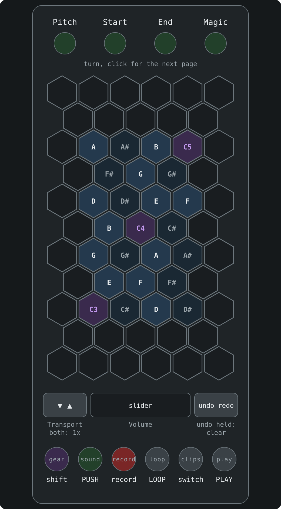
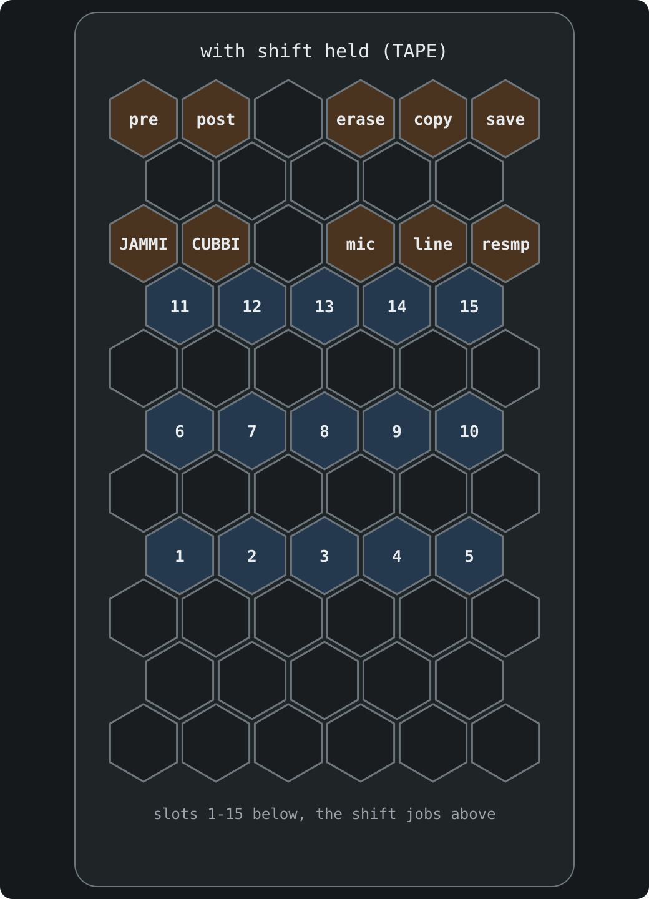

# nidhogg on an Exquis

The [Exquis](https://dualo.com/en/welcome/) by Intuitive Instruments works as a nidhogg controller in place of the OMX-27. It needs the Exquis firmware 2.1 or newer, which has the developer mode nidhogg uses to light the pads and read the knobs and buttons.

Plug it into the norns by USB and nidhogg picks it up. You can have an OMX-27 plugged in at the same time.

How CHOMPI itself plays is in the [README](../README.md): the norns screen, knobs and pages, the looper and so on. This page is only what's different on the Exquis.

## The controls

The pads in the middle are CHOMPI's keyboard, C3 to C5, laid out the way the Exquis lays out notes: a semitone to the right and thirds going up. Each note is on one pad. The Cs are lit in the bank colour so you can find the octaves, the C3 octave is faintly blue and the C4 octave faintly orange.

- The four knobs are **Pitch**, **Start**, **End** and **Magic**. Click one to go to its next page.
- The slider is **Volume**. While you touch it it shows the volume, and the rest of the time the output level.
- The arrows are **Transport**, slower and faster. Press both for normal speed.
- **gear** is CHOMPI's shift. Hold it and the pads change to the shift menu.
- **record** records while you hold it, whichever way the switch is.
- **sound** is PUSH: hold it and turn a knob, the arrows or the slider to go to that knob's next page.
- **loop** and **play** are **LOOP** and **PLAY**, and **clips** flips the Play/Record switch.
- Hold **undo** to clear the looper in TAPE or the sequence in WAVE.

## Shift

With shift held the pads show CHOMPI's shift menu: slots 1-15 on three rows, and the shift jobs above them in CHOMPI's groups. In TAPE those are the mode, what CHOMPI records, the FX order (pre and post) and the files on the card. TEMPO and WAVE have their own jobs in the same places.

## Good to know

- The Exquis has no screen, so the knob bars, levels and sample window the OMX-27 shows are only on the norns.
- When the screensaver comes on, the dragon flows up the pads as it crosses the norns screen.
- The Exquis's settings and sound menus aren't available while nidhogg is running. It gets them back when you leave nidhogg.
