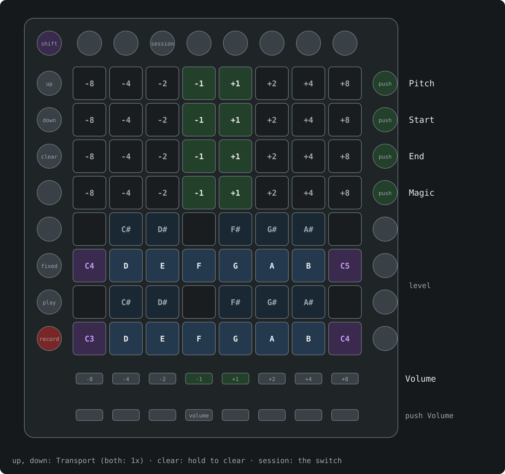
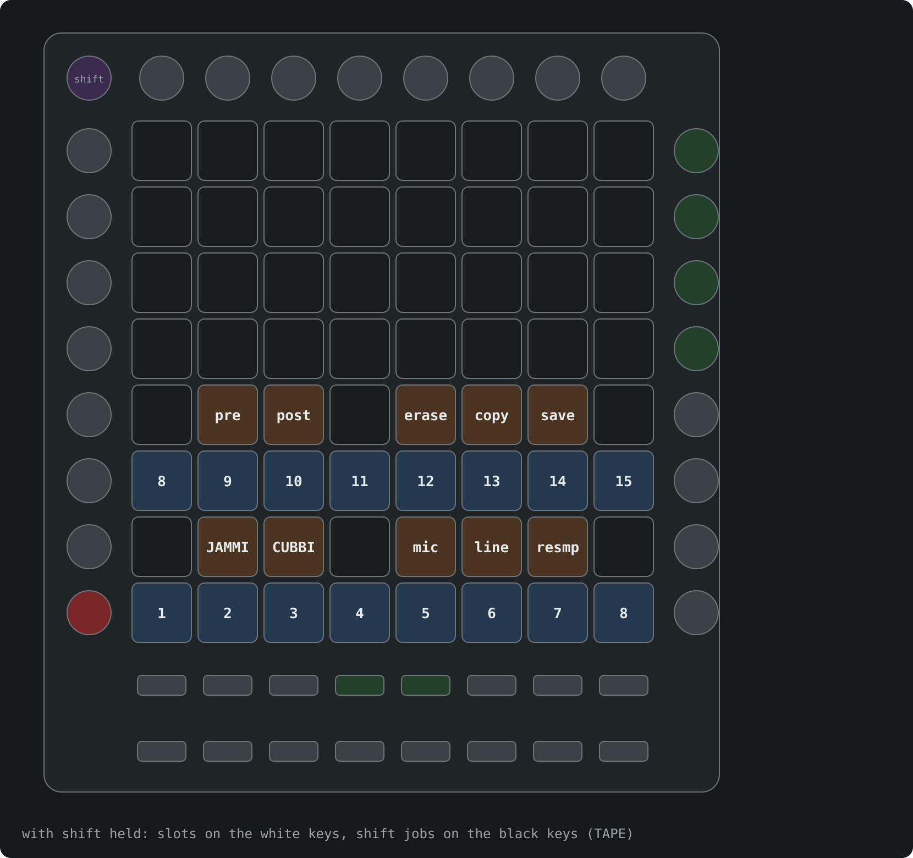

# nidhogg on a Launchpad Pro

The Novation Launchpad Pro [MK3] works as a nidhogg controller in place of the OMX-27. Plug it into the norns by USB and nidhogg picks it up and puts it in Programmer mode. You can have an OMX-27 or an Exquis plugged in at the same time.

How CHOMPI itself plays is in the [README](../README.md): the norns screen, knobs and pages, the looper and so on. This page is only what's different on the Launchpad.

## The controls

The bottom four rows are CHOMPI's keyboard, C3 to C5, as a piano: white keys on rows 1 and 3 and the black keys above them. The Cs are lit in the bank colour.

- The top four rows are **Pitch**, **Start**, **End** and **Magic**. Each pad nudges its knob, down on the left and up on the right, more the further from the middle, and keeps going while you hold it. The brightest pad in the row shows where the knob is, and Pitch marks its middle.
- The buttons right of those rows push that knob to its next page. They turn amber when it's on page 2 or 3.
- The row of buttons under the grid nudges **Volume** the same way, and **volume** below it pushes Volume.
- **up** and **down** are **Transport**, faster and slower. Press both for normal speed.
- **shift** is CHOMPI's shift and **record** records while you hold it.
- **play** is **PLAY** and **fixed length** is **LOOP**. Hold **clear** to clear the looper in TAPE or the sequence in WAVE.
- **session** flips the Play/Record switch.
- The buttons right of the keys show the output level.

## Shift

With shift held the keys are CHOMPI's shift menu, laid out as on its panel: slots 1-15 on the white keys and the shift jobs on the black keys, in CHOMPI's groups. In TAPE those are the mode, what CHOMPI records, the FX order (pre and post) and the files on the card. TEMPO and WAVE have their own jobs in the same places.

## Good to know

- The Launchpad has no screen, so the knob bars, levels and sample window the OMX-27 shows are only on the norns.
- When the screensaver comes on, the dragon flows up the grid as it crosses the norns screen.
- When you leave nidhogg the Launchpad goes back to its own Live mode.
