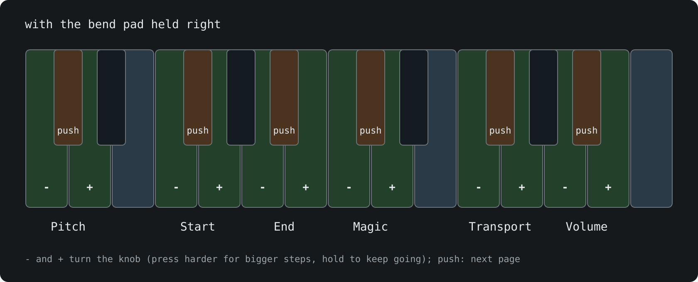

# nidhogg on a QuNexus

The Keith McMillen QuNexus works as a nidhogg controller. Its 25 keys are exactly CHOMPI's, C3 to C5. Plug it into the norns by USB and nidhogg picks it up. You can have other controllers plugged in at the same time, and the QuNexus is a nice keyboard next to one with knobs.

How CHOMPI itself plays is in the [README](../README.md): the norns screen, knobs and pages, the looper and so on. This page is only what's different on the QuNexus.

## Playing

- The keys play CHOMPI with velocity, so in TAPE and WAVE playing softer is quieter. TEMPO ignores velocity, as on CHOMPI.
- The keys light up the way CHOMPI's do, in white: the key you play, and in CUBBI the slots with samples.
- If the QuNexus sends pressure, **pressure to** in **PARAMETERS > EDIT** puts it on a knob.
- Leave **midi in from** on **none**, or every note arrives twice.
- Its octave buttons only move its own notes. In JAMMI, CHOMPI plays notes up to two octaves below its keys too, so octave down gives you lower notes. The key lights only match at the normal octave.

## The bend pad

The small pad at the bottom left does two jobs:

- **Hold it left** for CHOMPI's shift. The keys are then CHOMPI's shift menu as on its panel: slots 1-15 on the white keys and the shift jobs on the black keys.
- **Hold it right** to use the keys as knobs.

Each knob has three keys: the white keys either side turn it down and up, and the black key between them pushes it to its next page. Press harder for a bigger step, and hold a key to keep turning. The push key lights brighter when its knob is on page 2 or 3.

## Good to know

- The QuNexus has no screen, so the knob bars, levels and sample window the OMX-27 shows are only on the norns.
- When the screensaver comes on, the dragon passes along the keys.
